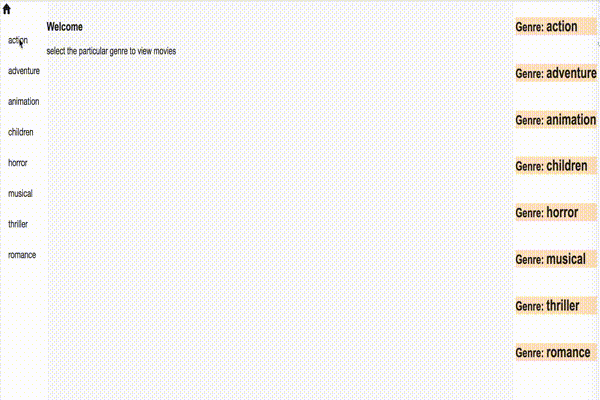

# Overview
This is for testing angular skills

We are going to use stackblitz online code editor for this task. Goto the following link in chrome 
https://stackblitz.com/edit/angular-interview-sample

This is your workspace where you will complete the project as per the instruction below.

# Pre-caution for this test

Do not touch the code in the directors directory. Consider that to be a extenal component ,. Since stackblitz does not allow import from git, I have included it here. 

# Context
There are three sections 

1. left pane with links to Moview Genres
1. The central pane which has the router outlet , it displays different genre components based on the link clicked
1. The left pane currently shows just the Genre's , but this is a set of of the directorsComponent elements on the app.component.html. 

# Task
1. Create a genre-movies component inside the genre-components which will be placed in a resuable way inside each of the genre components and will display the movies for that genre.
1. The director component has a public method exposed called `select`. When we click each action link on the left pane , this method for the director components shoud get called with true/false value based  on the selected genre

Your test is to fork this project in stackblitz(you may need to sign in for doing that) , and then in the forked project complete the code for the above mentioned tasks. If you believe you cannot complete this or don't have time for this then kindly at least come prepared with an approach of how would you go about the given tasks. Even if you have the correct approach you should be good. 

# On completion

On completing the code the application should behave in this way.

